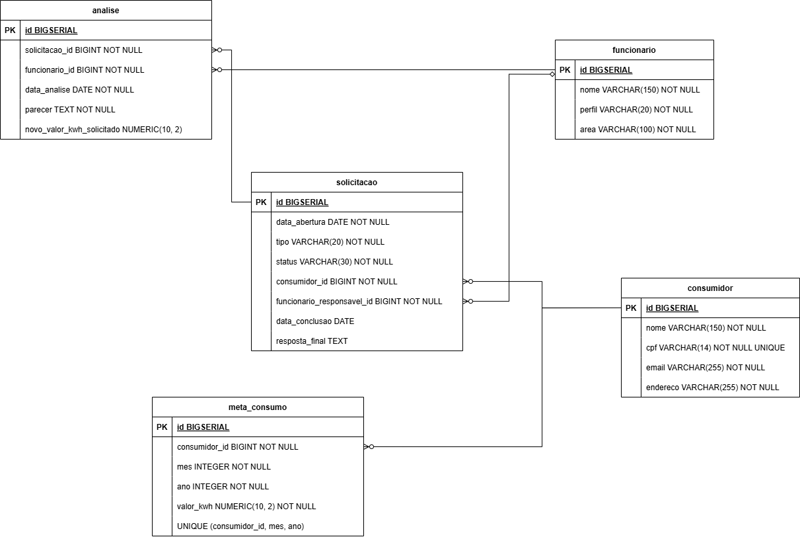

# API Concessionária

Esta API REST foi desenvolvida para gerenciar o fluxo de atendimento de uma concessionária. 
O sistema centraliza o relacionamento com o cliente, permitindo o registro de solicitações (como reclamações e revisões de metas de consumo), o acompanhamento detalhado de análises e decisões feitas pelos funcionários, além de fornecer indicadores sobre toda a operação.

## Funcionalidades

- **Gestão de Usuários**: Cadastro e consulta de Consumidores e Funcionários.
- **Solicitações**: Abertura de solicitações (Reclamações e Revisão de Metas) por consumidores.
- **Análises**: Registro de análises por funcionários (com opção de informar novo valor de kWh para revisões de metas).
- **Decisão Final**: Registro de decisão final (Aprovação ou Reprovação) com criação automática de nova meta de consumo em caso de aprovação.
- **Indicadores**: Consulta de indicadores gerais (total de solicitações, pendentes, concluídas, volume de reclamações, revisões e taxa de conversão/finalização).

## Tecnologias Utilizadas

- **Java 17+** e **Spring Boot 3**
- **Spring Data JPA** e **Hibernate** para persistência
- **PostgreSQL** como banco de dados (scripts SQL anexados abaixo)
- **Lombok** para redução de código boilerplate
- **Swagger / OpenAPI** para documentação da API
- **JUnit 5** e **Mockito** para testes de unidade e integração
- **Maven** como gerenciador de dependências

## Pré-requisitos
- Um servidor **PostgreSQL** rodando localmente na porta padrão `5432`.
- Banco de dados criado com o nome `concessionaria_desen`.
- Usuário `postgres` e senha `concessionaria321` configurados (caso sejam diferentes, ajuste em `src/main/resources/application.properties`).
- Crie as tabelas no banco de dados:

   

   <details>
   <summary>Script SQL</summary>

   ```sql
   CREATE TABLE consumidor (
       id BIGSERIAL PRIMARY KEY,
       nome VARCHAR(150) NOT NULL,
       cpf VARCHAR(14) NOT NULL UNIQUE,
       email VARCHAR(255) NOT NULL,
       endereco VARCHAR(255) NOT NULL
   );
   
   CREATE TABLE funcionario (
       id BIGSERIAL PRIMARY KEY,
       nome VARCHAR(150) NOT NULL,
       perfil VARCHAR(20) NOT NULL,
       area VARCHAR(100) NOT NULL
   );
   
   CREATE TABLE solicitacao (
       id BIGSERIAL PRIMARY KEY,
       data_abertura DATE NOT NULL DEFAULT CURRENT_DATE,
       tipo VARCHAR(20) NOT NULL,
       status VARCHAR(30) NOT NULL DEFAULT 'ABERTA',
       consumidor_id BIGINT NOT NULL REFERENCES consumidor(id),
       funcionario_responsavel_id BIGINT NOT NULL REFERENCES funcionario(id),
       data_conclusao DATE,
       resposta_final TEXT
   );
   
   CREATE TABLE analise (
       id BIGSERIAL PRIMARY KEY,
       solicitacao_id BIGINT NOT NULL REFERENCES solicitacao(id),
       funcionario_id BIGINT NOT NULL REFERENCES funcionario(id),
       data_analise DATE NOT NULL DEFAULT CURRENT_DATE,
       parecer TEXT NOT NULL,
       novo_valor_kwh_solicitado NUMERIC(10, 2)
   );
   
   CREATE TABLE meta_consumo (
       id BIGSERIAL PRIMARY KEY,
       consumidor_id BIGINT NOT NULL REFERENCES consumidor(id),
       mes INTEGER NOT NULL,
       ano INTEGER NOT NULL,
       valor_kwh NUMERIC(10, 2) NOT NULL,
       UNIQUE (consumidor_id, mes, ano)
   );
   ```

   </details>

## Como Usar

Com a aplicação no ar utilize os endpoints da API no Swagger.

Acesse no navegador: **http://localhost:8080/swagger-ui.html**

### Fluxo de Exemplo

1. No Swagger, expanda a rota **POST /consumidores** e crie um consumidor.
2. Faça o mesmo em **POST /funcionarios** para registrar um funcionário.
3. Expanda **POST /solicitacoes** para abrir um pedido (informando o CPF do consumidor cadastrado e o tipo `RECLAMACAO` ou `REVISAO_META`).
4. Você pode acompanhar as métricas sendo atualizadas usando o endpoint **GET /indicadores/solicitacoes**.